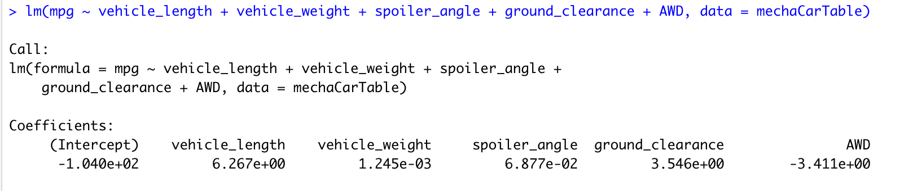
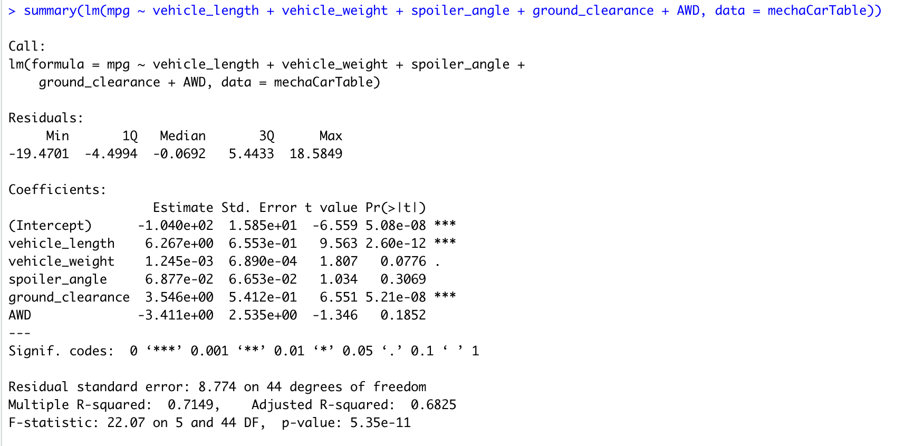
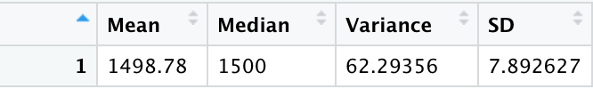
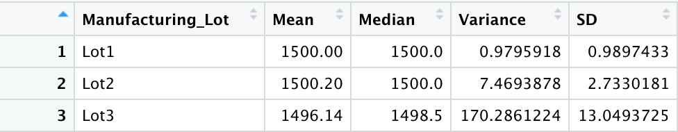

# MechaCar_Statistical_Analysis

## Linear Regression to Predict MPG

### The linear regression equation is described by the following coefficients and intercept.
- mpg = 6.267(vehicle_length) + 0.001245(vehicle_weight) + .06877(spoiler_angle) + 3.546(ground_clearance)-3.411(AWD)-.0104

### Statistical significance
According to the summary of the multiple linear regression equation, the vehicle_length and ground_clearance (and the intercept) provided a non-random amount of variance to the mpg values in the dataset. (see below)

### Slope
The p-value is xtremely small (5.35e-11) indicating that there is sufficient evidence to reject the null hypothesis. Therefore, the independent variables do contribute to the mpg variability.

### Accuracy
This multiple linear regression model has a multiple R-squared of 0.7149 which means that roughly 71% of the variability in the MPG is explained using this model. This is a fairly high correlation so we can say yes, this linear model predicts the mpg of MechaCar prototypes accurately 70% of the time.

## Summary Statistics on Suspension Coils

The suspension coils data includes 150 measurements of PSI from 3 different lots. The mean, median, variance, and standard deviation of all of the PSI measurements is as follows.

The following table shows the summary statistics (mean, median, variance, standard deviation) for the PSI measurements per lot number of suspension coils. 

### Design and Manufacturing Specifications
"The design specifications for the MechaCar suspension coils dictate that the variance of the suspension coils must not exceed 100 PSI. Does the current manufacturing data meet this design specification?"
- For all manufacturing lots combined, the variance is 62.3 PSI and therefore the suspension coils DO meet the design specification.
- Lot 1 has a variance of less than 1 PSI, and therefore Lot 1 DOES meet the design specification.
- Lot 2 has a variance of less than 7.5 PSI and therefore Lot 2 DOES meet the design specifications.
- Lot 3 has a variance of 170.3 PSI and therefore DOES NOT meet the design specification of a variance of no more than 100 PSI. 

